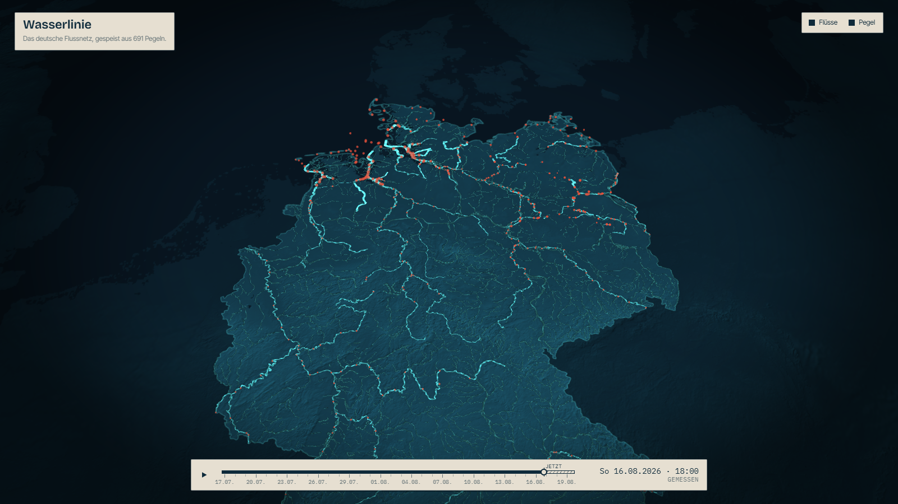
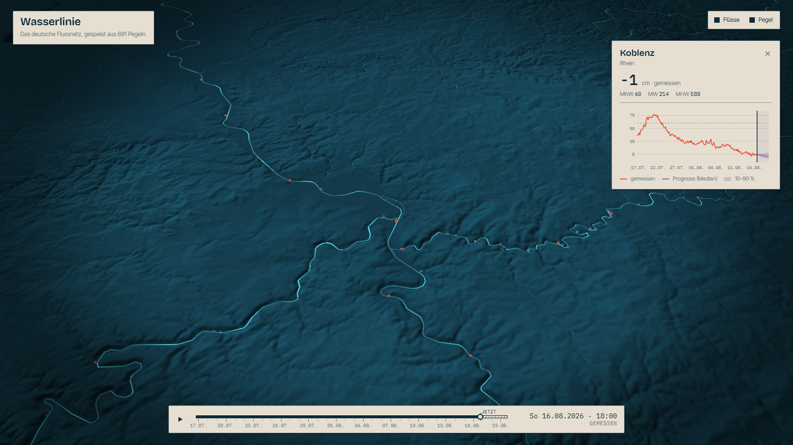

# Wasserlinie



Germany's river network as a living map. Every river that has a gauge on it
draws its width, brightness and flow speed from real water levels — high
water swells and pulses faster, low water runs thin and matte. Drag the time
slider through the last weeks and the whole network breathes with it; push
past "now" and it turns into a forecast, visibly softer and less certain the
further you go.

[](https://github.com/Naxter/wasserlinie/actions/workflows/ci.yml)




## What it does

- **Rivers that carry data.** ~2,500 river parts from the official German
  topographic model, drawn on real terrain. The 58 parts that have gauges are
  driven by measurements: the level between neighbouring gauges is
  interpolated along the river, and the shader turns it into width, glow and
  pulse speed.
- **Gauges are the only red thing.** ~700 PEGELONLINE stations. Red means
  someone actually measures here; everything computed is never red.
- **Time is physical.** One slider covers the stored history plus 72 hours
  ahead. The sun follows it, so scrubbing moves the terminator across the
  country.
- **Forecast that looks like a forecast.** A small gradient-boosting model
  produces p10/p50/p90 per station. On the map the future is haze-coloured
  and soft; the wider the band, the softer the line. In the station panel the
  median sits inside its 10–90 % band.
- **No servers.** The pipeline writes Parquet and JSON files; the browser
  queries the Parquet directly with DuckDB-WASM. Static hosting is enough.
- **No satellite imagery, no ion token.** Terrain and a hand-made hillshade
  come from public elevation tiles, rendered in the browser.

## How it is built

```text
pipeline/  Python                        public/data/            src/  TypeScript + Cesium
─────────────────────────────────        ──────────────────      ─────────────────────────────
PEGELONLINE ─ fetch ─────────────────▶   stations.json           scene/   terrain, relief, camera,
              (hourly means, 90 d)       levels.parquet ───────▶          post-processing, clock
BKG DLM1000 ─ rivers ────────────────▶   rivers.json    ───────▶ layers/  rivers (GLSL field),
              (axes + polygon skeleton)                                    gauges (billboards)
levels ────── forecast (GBM p10/50/90) ▶ forecast/*.parquet ───▶ data/    DuckDB-WASM, timeline
all ────────── field (interpolate) ────▶ field.bin + field.json ▶ ui/     React panels, time bar
```

The one rule that matters: React never touches a GPU buffer. The UI reads
and writes a small store; the scene subscribes to it.

Rivers with gauges each get a tiny texture — position along the river on one
axis, time on the other, three bytes per cell (level index, measured or
forecast, forecast spread). The fragment shader samples it at the slider's
time. Interpolating between gauges happens once, in Python, not per frame.

## Quickstart

The repository ships a data snapshot, so the app runs without any credentials.

```bash
npm install
npm run dev
```

Open <http://localhost:5173>. Terrain tiles stream from AWS on first view.

## Refreshing the data

The pipeline lives in `pipeline/` and needs Python 3.11+.

```bash
cd pipeline
python -m venv .venv && . .venv/bin/activate   # Windows: .venv\Scripts\activate
pip install -e ".[dev]"
python -m wasserlinie all
```

`all` runs four steps, each usable on its own:

| Step       | What it does                                                                                        |
| ---------- | --------------------------------------------------------------------------------------------------- |
| `fetch`    | Stations and 15-minute readings from PEGELONLINE → hourly `levels.parquet`, `stations.json`. Merges with earlier runs and keeps 90 days. |
| `rivers`   | Downloads BKG DLM1000 (56 MB, cached), merges river axes, skeletonises wide rivers that only exist as polygons, snaps gauges onto them → `rivers.json`, `germany.json`. |
| `forecast` | Trains three quantile GBMs on all stations at once and writes a run into `forecast/` plus `manifest.json`. |
| `field`    | Interpolates levels along every gauged river for each 6-hour step → `field.bin`, `field.json`.        |

PEGELONLINE only serves about a month of history per request; the 90-day
window fills up by running `fetch` daily (a cron job or a scheduled workflow
is enough). Point the app at a different data location with
`VITE_DATA_URL` — see `.env.example`.

Formats are documented in [docs/data.md](docs/data.md).

## Honesty notes

- The forecast knows only the recent shape of each level curve. No rainfall,
  no upstream routing. It is there to show what uncertainty looks like, not to
  be relied on.
- Levels are compared between stations as a position between each gauge's
  own low- and high-water marks (MNW/MHW, MTnw/MThw for tidal gauges). ~230
  stations publish no such marks; they still appear as gauges but do not feed
  the network and their forecast is not drawn on the map.
- River geometry is 1:1,000,000. Close up, lines can drift a few hundred
  metres from the actual water.

## Development

```bash
npm run typecheck
npm run lint
npm test
npm run build

cd pipeline && ruff check . && pytest
```

## Data sources and credits

- Water levels: [PEGELONLINE](https://www.pegelonline.wsv.de) — WSV, free for reuse.
- River network and country outline: [BKG DLM1000 and VG2500](https://gdz.bkg.bund.de) — © GeoBasis-DE / BKG 2025, [dl-de/by-2-0](https://www.govdata.de/dl-de/by-2-0).
- Terrain: [AWS Terrain Tiles](https://registry.opendata.aws/terrain-tiles/) — Mapzen, SRTM, EU-DEM and others.
- Rendering: [CesiumJS](https://cesium.com/platform/cesiumjs/); Parquet in the browser: [DuckDB-WASM](https://duckdb.org/docs/api/wasm/overview).

## License

MIT — see [LICENSE](LICENSE).
